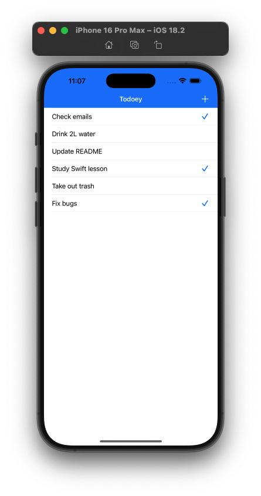

# Todoey ✓

## Screenshot / Ekran Görüntüsü

## 🇬🇧 English

A simple and efficient Todo list application for iOS that helps you keep track of all your tasks. This project was implemented while following Angela Yu's iOS Development Course.

### Features

- ✏️ Create new todo items
- ✓ Mark tasks as completed
- 🗑️ Delete tasks with swipe gesture
- 💾 Persistent data storage using PropertyList

### Implementation Details

This project was built using:
- Swift
- UIKit
- MVC Architecture
- PropertyList for data persistence
- UITableView for list display
- UIAlertController for adding new items

### Learning Journey

This project was completed as part of Angela Yu's iOS Development Course, focusing on:
- iOS app development fundamentals
- Working with UITableViews
- Implementing data persistence
- Understanding iOS design patterns
- User interface design and interaction

---
## 🇹🇷 Türkçe

iOS için basit ve verimli bir Todo list uygulaması, tüm görevlerinizi takip etmenize yardımcı olur. Bu proje, Angela Yu'nun iOS Geliştirme Kursu takip edilerek uygulanmıştır.
### Özellikler

- ✏️ Yeni görevler oluşturma
- ✓ Görevleri tamamlandı olarak işaretleme
- 🗑️ Kaydırma hareketiyle görevleri silme
- 💾 PropertyList kullanarak kalıcı veri depolama

### Uygulama Detayları

Bu proje şu teknolojiler kullanılarak geliştirilmiştir:
- Swift
- UIKit
- MVC Mimarisine uygun yapı
- Veri kalıcılığı için PropertyList
- Liste görüntüleme için UITableView
- Yeni görev eklemek için UIAlertController

### Öğrenme Süreci

Bu proje, Angela Yu'nun iOS Geliştirme Kursu kapsamında tamamlanmıştır ve şu konulara odaklanılmıştır:
- iOS uygulama geliştirme temelleri
- UITableView ile çalışma
- Veri kalıcılığını uygulama
- iOS tasarım kalıplarını anlama
- Kullanıcı arayüzü tasarımı ve etkileşimleri

---
